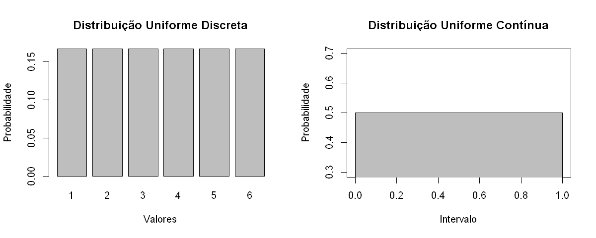
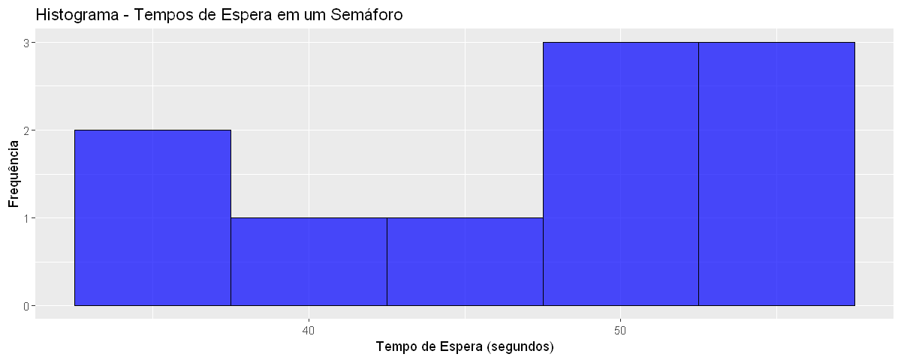
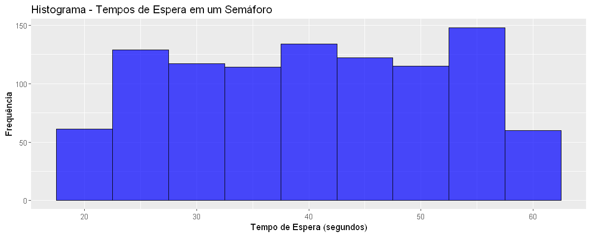

# Distribuição Uniforme

**Prof. Gallileu Genesis**

### 1. Distribuição Uniforme 

A Distribuição Uniforme é uma das distribuições de probabilidade mais simples e fundamentais. Ela descreve um cenário em que todos os eventos possíveis têm a mesma probabilidade de ocorrer. Isso significa que cada valor dentro de um intervalo específico é igualmente provável de ser observado.

Pode ser usada para modelar tanto variáveis discreta quanto variáveis continuas e é frequentemente representada graficamente como um retângulo, onde a altura do retângulo representa a probabilidade e a largura representa a amplitude do intervalo.

#### 1.1 Distribuição Uniforme Discreta
A distribuição uniforme discreta é usada quando temos um número finito de valores possíveis, e cada um deles tem a mesma probabilidade. Matematicamente, para uma distribuição uniforme discreta com valores no conjunto {$x_1, x_2, ..., x_n$}, a função de probabilidade é definida da seguinte maneira:


$P(X = x_i) = \dfrac{1}{n}$ ,   para $i = 1, 2, ..., n$

Onde:

- $P(X = x_i)$ é a probabilidade de a variável aleatória $X$ assumir o valor $x_i$.
- $n$ é o número total de valores possíveis, ou seja, o tamanho do conjunto de valores {$x_1, x_2, ..., x_n$}.

A média (valor esperado) de uma distribuição uniforme discreta é calculada da seguinte forma:

- Média: $\mu = \dfrac{(x_1 + x_2 + ... + x_n)}{n} = \dfrac{1}{n}  \sum_{i=1}^{n} x_i$ 

A variância de uma distribuição uniforme discreta é calculada como:

- Variância: $\sigma^2 = \dfrac{(x_1 - \mu)^2 + (x_2 - \mu)^2 + ... + (x_n - \mu)^2}{n} =  \dfrac{1}{n} \sum_{i=1}^{n} (x_i - \mu)^2$


Um exemplo clássico é o lançamento de um dado justo de seis faces. Cada número de 1 a 6 tem uma probabilidade de 1/6 de ser lançado (Figura da esquerda, abaixo).

#### 1.2 Distribuição Uniforme contínua

A distribuição uniforme contínua é usada quando os valores possíveis formam um intervalo contínuo. Matematicamente, uma distribuição uniforme contínua em um intervalo $[a, b]$ é definida pela sua função de densidade de probabilidade $f(x)$ da seguinte forma:

$f(x) = \begin{cases}
         \dfrac{1}{b - a}, & \text{se } a \leq x \leq b \\
         0, & \text{caso contrário}
       \end{cases}$


Onde:
- $a$ e $b$ são os limites inferior e superior do intervalo, respectivamente.
- $x$ é uma variável aleatória dentro desse intervalo.

A integral da função de densidade de probabilidade ao longo do intervalo $[a, b]$ é igual a 1, o que significa que a área sob a curva da distribuição uniforme é sempre igual a 1. Isso reflete o fato de que a probabilidade total de todos os eventos possíveis deve ser igual a 1.

Além disso, a média (valor esperado) e a variância de uma distribuição uniforme no intervalo $[a, b]$ podem ser calculadas da seguinte forma:

- Média: $\mu = \dfrac{a + b}{2}$  
- Variância:  $\sigma^2 = \dfrac{(b - a)^2}{12}$

Um exemplo é a escolha de um número aleatório entre 0 e 1. Nesse caso, qualquer número dentro desse intervalo tem a mesma probabilidade de ser escolhido, e a probabilidade é distribuída uniformemente ao longo desse intervalo (Figura da direita, abaixo).


```R
# Dados para a distribuição uniforme discreta
valores_discretos <- c(1, 2, 3, 4, 5, 6)
probabilidade_discreta <- rep(1/6, 6)  # Probabilidade de 1/6 igual para cada valor

# Dados para a distribuição uniforme contínua
a <- 0 # inicio do intervalo
b <- 1 # fim intervalo
intervalo_contínuo <- seq(from = a, to = a, length.out = 100)
probabilidade_contínua <- rep(0.5, 100)  # Probabilidade de 0.5 constante dentro do intervalo

# Define o tamanho das figuras
options(repr.plot.width = 10, repr.plot.height = 4)

# Criação dos gráficos usando plot() do pacote base do R
par(mfrow=c(1, 2))  # Configuração para exibir os gráficos lado a lado

# Gráfico da distribuição uniforme discreta
barplot(probabilidade_discreta, names.arg = valores_discretos, main = "Distribuição Uniforme Discreta", xlab = "Valores", ylab = "Probabilidade")

# Gráfico da distribuição uniforme contínua 
plot(intervalo_contínuo, probabilidade_contínua, type = "n", main = "Distribuição Uniforme Contínua", xlab = "Intervalo", ylab = "Probabilidade")
polygon(c(intervalo_contínuo, rev(intervalo_contínuo)), c(probabilidade_contínua, rep(0, length(probabilidade_contínua))), col = "gray")
lines(intervalo_contínuo, probabilidade_contínua, type = "l")

# Configuração para salvar em uma única figura
png("Figures/distribuicoes.png", width = 800, height = 400)

# Reset das configurações de layout
par(mfrow=c(1, 1))

```


    

    


#### Exemplo: Tempo de espera em um semáforo

Vamos considerar um exemplo onde estamos interessados em modelar o tempo de espera aleatório que um motorista pode ter em um semáforo de trânsito. Suponha que o tempo de espera em segundos está uniformemente distribuído entre 20 e 60 segundos.


```R
# Gerando 10 valores aleatórios seguindo a distribuição uniforme contínua
a <- 20
b <- 60
num_values <- 10
random_values <- runif(num_values, min = a, max = b)

# Criando um histograma
histogram <- ggplot(data.frame(x = random_values), aes(x)) +
  geom_histogram(binwidth = 5, fill = "blue", color = "black", alpha = 0.7) +
  labs(title = "Histograma - Tempos de Espera em um Semáforo",
       x = "Tempo de Espera (segundos)",
       y = "Frequência")

# Exibindo o histograma
print(histogram)

# Calculando a média e a variância
mean_value <- mean(random_values)
variance <- var(random_values)

# Exibindo os resultados
cat("Valores aleatórios:", random_values, "\n")
cat("Média:", mean_value, "\n")
cat("Variância:", variance, "\n")
```

    Valores aleatórios: 53.19356 50.58862 45.51637 36.22017 51.51233 55.44144 56.8377 48.71494 38.6505 36.34629 
    Média: 47.30219 
    Variância: 60.36523 
    


    

    


O que acontece se gerarmos não 10, mas 1000 valores aleatório? Sim, notem que a média do tempo se descola mais para o centro do intervalo de distribuição e a distribuição começa a tomar uma forma mais uniforme, como era esperado. 


```R
# Gerando 1000 valores aleatórios seguindo a distribuição uniforme contínua
a <- 20
b <- 60
num_values <- 1000
random_values <- runif(num_values, min = a, max = b)

# Criando um histograma
histogram <- ggplot(data.frame(x = random_values), aes(x)) +
  geom_histogram(binwidth = 5, fill = "blue", color = "black", alpha = 0.7) +
  labs(title = "Histograma - Tempos de Espera em um Semáforo",
       x = "Tempo de Espera (segundos)",
       y = "Frequência")

# Exibindo o histograma
print(histogram)

# Calculando a média e a variância
mean_value <- mean(random_values)
variance <- var(random_values)

# Exibindo os resultados
cat("Média:", mean_value, "\n")
cat("Variância:", variance, "\n")
```

    Média: 40.24155 
    Variância: 136.0465 
    


    

    


```R

```
